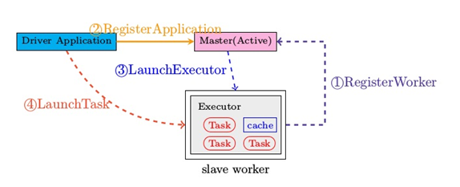
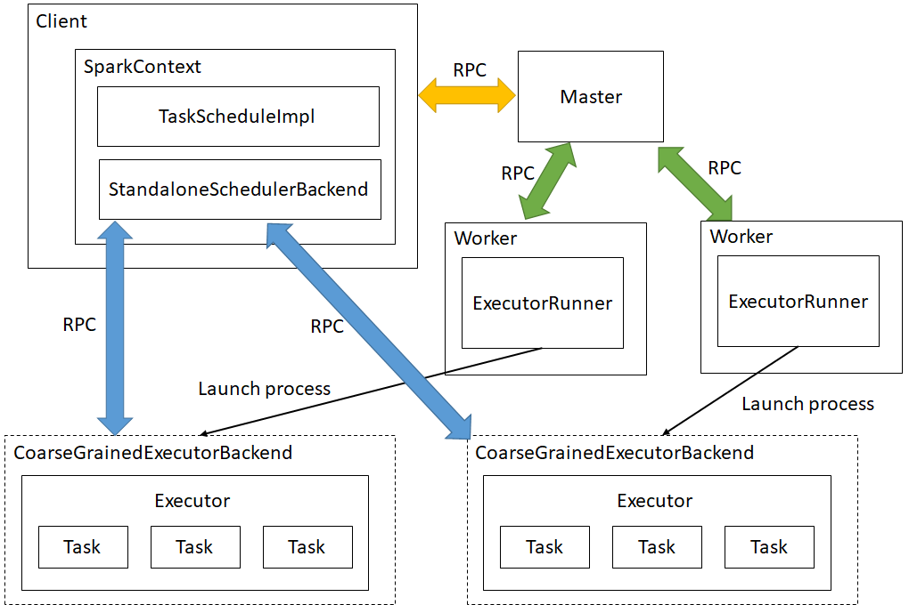
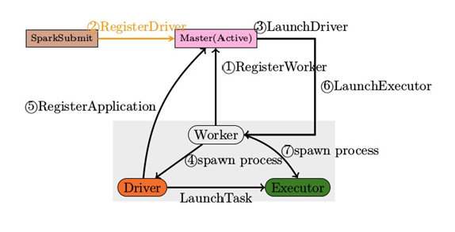
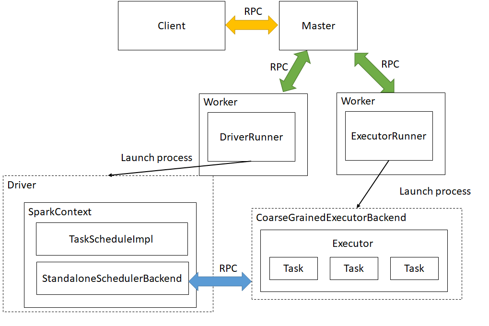
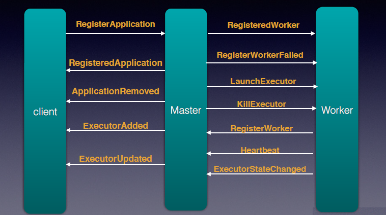
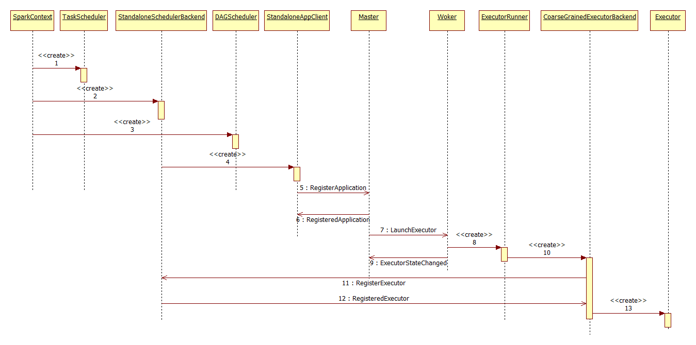

# Spark2.X---Deploy模块解析 #


## 1.	模块整体架构   ##

Deploy模块是spark standalone的分布式框架，其采用master/slave架构，主要包括以下几个进程。
Master：  
1）	接受worker注册并管理所有的worker，并命令Worker启动Driver和Executor。  
2）	接受client提交的Application，并将Application提交给worker。

Worker：  
1）	启动时，向Master注册自己，定期向Master汇报心跳  
2）	接受Master的命令，启动Driver和Executor。

Client：
向Master提交Application，并注册在master监控Application的状态。

Driver：
一个Spark作业运行时包括一个Driver进程，也是作业的主进程，负责DAG图的构建，stage划分，task的管理和调度，主要包括DAGScheduler，TaskScheduler及SchedulerBackend。

Executor：  
1）	Executor接收Driver的命令  
2）	一个Executor可以执行一个或者多个task  

Standalone有两种部署模式，client和cluster  
Client模式: 即Driver运行在Client。  

&emsp;&emsp;&emsp;&emsp;&emsp;&emsp;&emsp;&emsp;&emsp;&emsp;&emsp;&emsp;&emsp;&emsp;图1 Client模式下交互图  
更详细的架构图如下：


Cluster模式: Driver运行在Executor。  
  &emsp;&emsp;&emsp;&emsp;&emsp;&emsp;&emsp;&emsp;&emsp;&emsp;&emsp;&emsp;&emsp;&emsp;图2 Cluster模式下交互图  
更详细的架构图如下：
 

## 2.消息传递机制详解 ##

 

2.1 Master和Worker  

Worker-> Master  


```scala
case class RegisterWorker(
    id: String,
    host: String,
    port: Int,
    worker: RpcEndpointRef,
    cores: Int,
    memory: Int,
    workerWebUiUrl: String)
    extends DeployMessage {
  Utils.checkHost(host, "Required hostname")
assert (port >0)
}

case class ExecutorStateChanged(
appId: String,
execId: Int,
state: ExecutorState,
message: Option[String],
exitStatus: Option[Int])
extends DeployMessage

case class DriverStateChanged(
driverId: String,
state: DriverState,
exception: Option[Exception])
extends DeployMessage

case class WorkerSchedulerStateResponse(id: String, executors: List[ExecutorDescription],
driverIds: Seq[String])

case class WorkerLatestState(
id: String,
executors: Seq[ExecutorDescription],
driverIds: Seq[String]) extends DeployMessage

case class Heartbeat(workerId: String, worker: RpcEndpointRef) extends DeployMessage
```


| 消息名称                         | 作用                                       |
| ---------------------------- | ---------------------------------------- |
| RegisterWorker               | Worker启动后，会向Master发送消息进行注册，Master会响应RegisteredWorker给worker |
| ExecutorStateChanged         | 当Executor的状态有更新的时候，会向Master汇报            |
| DriverStateChanged           | 当Driver的状态有更新时，DriverRunner会先向worker发送状态更新消息，再转给master |
| WorkerSchedulerStateResponse | 在Master故障恢复时，会向注册过的Worker发送MasterChanged的消息，Worker通过最新的Master URL向Master回复WorkerSchedulerStateResponse消息汇报Worker上运行的Executor和Driver |
| WorkerLatestState            | Worker注册到Master之后，Master收到会此消息，会和当前Master的Driver和Executor进行比对，并通知Worker去kill多余的Driver和Executor |
| Heartbeat                    | Worker向Master发送的心跳，间隔可以通过spark.worker.timeout设置，注意这个值的四分之一才是心跳间隔，默认值为15秒。 |

Master-->Worker

```scala
case class RegisteredWorker(master: RpcEndpointRef, masterWebUiUrl: String) extends DeployMessage with RegisterWorkerResponse

case class RegisterWorkerFailed(message: String) extends DeployMessage with RegisterWorkerResponse

case class ReconnectWorker(masterUrl: String) extends DeployMessage

case class KillExecutor(masterUrl: String, appId: String, execId: Int) extends DeployMessage

case class LaunchExecutor(
  masterUrl: String,
  appId: String,
  execId: Int,
  appDesc: ApplicationDescription,
  cores: Int,
  memory: Int
)extends DeployMessage

case class LaunchDriver(driverId: String, driverDesc: DriverDescription) extends DeployMessage

case class KillDriver(driverId: String) extends DeployMessage

case class ApplicationFinished(id: String)
```

| 消息名称                 | 作用                                       |
| -------------------- | ---------------------------------------- |
| RegisteredWorker     | Worker注册成功后的返回消息                         |
| RegisterWorkerFailed | Worker注册失败                               |
| ReconnectWorker      | 当心跳超时后，Master会发送该消息告知该Woker需要重新注册        |
| KillExecutor         | 当Application完成后，Master会告知Worker删除指定的Executor |
| LaunchExecutor       | Master根据调度策略为Appplication分配资源，会告知Worker发送启动Executor |
| LaunchDriver         | Master根据调度策略为Appplication分配资源，会告知Worker发送启动Driver |
| KillDriver           | Master会告知Worker删除指定的Driver               |
| ApplicationFinished  | 当Application完成后，Master会告知Worker释放资源      |

2.2 Master和Client

DriverClient <-> Master

```scala
// DriverClient <-> Master

case class RequestSubmitDriver(driverDescription: DriverDescription) extends DeployMessage

case class SubmitDriverResponse(
  master: RpcEndpointRef, 
  success: Boolean, 
  driverId: Option[String], 
  message: String) extends DeployMessage

case class RequestKillDriver(driverId: String) extends DeployMessage
case class KillDriverResponse(
  master: RpcEndpointRef, 
  driverId: String, 
  success: Boolean, 
  message: String) extends DeployMessage

case class RequestDriverStatus(driverId: String) extends DeployMessage
case class DriverStatusResponse(
  found: Boolean, 
  state: Option[DriverState],
  workerId: Option[String], 
  workerHostPort: Option[String], 
  exception: Option[Exception]
)
```

2.3 Driver和Executor


```scala
// Driver to executors
case class LaunchTask(data: SerializableBuffer) extends CoarseGrainedClusterMessage

case class KillTask(taskId: Long, executor: String, interruptThread: Boolean)
extends CoarseGrainedClusterMessage

case object RegisteredExecutor extends CoarseGrainedClusterMessage with RegisterExecutorResponse

case class RegisterExecutorFailed(message: String) extends CoarseGrainedClusterMessage
with RegisterExecutorResponse
```

| 消息名称                   | 作用                          |
| ---------------------- | --------------------------- |
| LaunchTask             | Driver通知Executor启动一个task    |
| KillTask               | 停止task                      |
| RegisteredExecutor     | 回复ExecutorBackend注册Executor |
| RegisterExecutorFailed | 回复注册Executor失败              |

```scala
// Executors to driver

case class RegisterExecutor(
  executorId: String,
  executorRef: RpcEndpointRef,
  hostname: String,
  cores: Int,
  logUrls: Map[String, String]) extends CoarseGrainedClusterMessage

case class StatusUpdate(
  executorId: String, 
  taskId: Long, 
  state: TaskState,
  data: SerializableBuffer) extends CoarseGrainedClusterMessage
```


| 消息名称             | 作用                   |
| ---------------- | -------------------- |
| RegisterExecutor | 注册Executor           |
| StatusUpdate     | 汇报Executor中运行的Task状态 |

## 3. Standalone模式下的Executor模块分析

Executor模块是负责运行Task计算任务，并将结果返回给Driver，尽管Spark支持多种资源调度框架，比如mesos，yarn，standalone，这些资源框架在分配资源以后，最后都会让Executor完成最后的计算。

 

下面主要介绍Standalone模式下Executor模块交互过程



Step1- 4: SchedulerBackend创建StandaloneAppClient

```scala
// Create and start the scheduler
val (sched, ts) = SparkContext.createTaskScheduler(this, master, deployMode)
_schedulerBackend = sched
_taskScheduler = ts
_dagScheduler = new DAGScheduler(this)
……

// start TaskScheduler after taskScheduler sets DAGScheduler reference in DAGScheduler's
// constructor
_taskScheduler.start()
```

Step 5-6：StandaloneAppClient向Master注册Application

首先StandaloneAppClient调用Start, 初始化RPCEnv

```scala
endpoint.set(rpcEnv.setupEndpoint("AppClient", new ClientEndpoint(rpcEnv)))
```

初始化的过程中会调用registerWithMaster，最终调用tryRegisterAllMasters

```scala
private def registerWithMaster(nthRetry: Int) {
  registerMasterFutures.set(tryRegisterAllMasters())
  registrationRetryTimer.set(registrationRetryThread.schedule(new Runnable {
    override def run(): Unit = {
      if (registered.get) {
        registerMasterFutures.get.foreach(_.cancel(true))
        registerMasterThreadPool.shutdownNow()
      } else if (nthRetry >= REGISTRATION_RETRIES) {
        markDead("All masters are unresponsive! Giving up.")
      } else {
        registerMasterFutures.get.foreach(_.cancel(true))
        registerWithMaster(nthRetry + 1)
      }
    }
  }, REGISTRATION_TIMEOUT_SECONDS, TimeUnit.SECONDS))
}
```

向所有的Master注册Application

```scala
private def tryRegisterAllMasters(): Array[JFuture[_]] = {
  for (masterAddress <- masterRpcAddresses) yield {
    registerMasterThreadPool.submit(new Runnable {
      override def run(): Unit = try {
        if (registered.get) {
          return
        }

        logInfo("Connecting to master " + masterAddress.toSparkURL + "...")
        val masterRef = rpcEnv.setupEndpointRef(masterAddress, Master.ENDPOINT_NAME)
        masterRef.send(RegisterApplication(appDescription, self))
      } catch {
        case ie: InterruptedException =>// Cancelled
        case NonFatal(e) => logWarning(s"Failed to connect to master $masterAddress", e)
      }
    })
  }
}
```

Master收到RegisterApplication后，创建ApplicationInfo，并将其放到自己的数据结构中

```scala
caseRegisterApplication(description, driver) =>
if (state == RecoveryState.STANDBY) {
	// ignore, don't send response
}else {
  logInfo("Registering app " + description.name)
  val app = createApplication(description, driver)
  registerApplication(app)
  logInfo("Registered app " + description.name + " with ID " + app.id)
  persistenceEngine.addApplication(app)
  driver.send(RegisteredApplication(app.id, self))
  schedule()
}
```

```scala
private def registerApplication(app: ApplicationInfo): Unit = {
  val appAddress = app.driver.address
  if (addressToApp.contains(appAddress)) {
    logInfo("Attempted to re-register application at same address: " + appAddress)
    return
  }
  applicationMetricsSystem.registerSource(app.appSource)
  //保存在Master上所有Application
  apps += app
  //app.id是在Master端分配的，格式是”app-currentdate-nextAppNumber,其中nextAppNumber是Master启动以来注册Application的总数-1，取四位数”

  idToApp(app.id) = app
  endpointToApp(app.driver) = app
  addressToApp(appAddress) = app
  //等待被调度的Application

  waitingApps += app
  if (reverseProxy) {
    webUi.addProxyTargets(app.id, app.desc.appUiUrl)
  }
}
```

Step7：Master根据StandaloneAppClient提交的应用信息选择Worker

org.apache.spark.deploy.master.Master#schedule为处于等待分配资源的Application分配资源，在每次有新的Application加入或者新的资源加入时都会调用schedule进行调度。为Application分配资源选择Worker，有两种策略：

1）  尽量打散，即将Application尽可能多地分配到不同节点，可以通过设置spark.deploy.spreadOut来实现，默认值为true。

2）  尽量集中，即将Application尽可能分配到很少的节点上。CPU密集型同时内存又占用的少的Application适合这种策略。

 ```scala
/**
  Schedule and launch executors on workers
*/
private def startExecutorsOnWorkers(): Unit = {
  // Right now this is a very simple FIFO scheduler. We keep trying to fit in the first app
  // in the queue, then the second app, etc.
  for (app <- waitingApps if app.coresLeft >0) {
    val coresPerExecutor: Option[Int] = app.desc.coresPerExecutor
    // Filter out workers that don't have enough resources to launch an executor
    val usableWorkers = workers.toArray.filter(_.state == WorkerState.ALIVE).filter(worker=>         worker.memoryFree >= app.desc.memoryPerExecutorMB &&worker.coresFree >=                         coresPerExecutor.getOrElse(1)).sortBy(_.coresFree).reverse
    val assignedCores = scheduleExecutorsOnWorkers(app, usableWorkers, spreadOutApps)
    // Now that we've decided how many cores to allocate on each worker, let's allocate them
    for (pos <- 0 until usableWorkers.length if assignedCores(pos) >0) {
      allocateWorkerResourceToExecutors(
        app, assignedCores(pos), coresPerExecutor, usableWorkers(pos))
    }
  }
}
 ```

向Worker申请启动启动Executor

```scala
private def allocateWorkerResourceToExecutors(
  app: ApplicationInfo,
  assignedCores: Int,
  coresPerExecutor: Option[Int],
  worker: WorkerInfo): Unit = {
  // If the number of cores per executor is specified, we divide the cores assigned
  // to this worker evenly among the executors with no remainder.
  // Otherwise, we launch a single executor that grabs all the assignedCores on this worker.

  val numExecutors = coresPerExecutor.map { assignedCores / _ }.getOrElse(1)
  val coresToAssign = coresPerExecutor.getOrElse(assignedCores)
  for (i <- 1 to numExecutors) {
    val exec = app.addExecutor(worker, coresToAssign)
    launchExecutor(worker, exec)
    app.state = ApplicationState.RUNNING
  }
}
```

向worker发送LaunchExecutor，向Driver通知ExecutorAdded

```scala
private def launchExecutor(worker: WorkerInfo, exec: ExecutorDesc): Unit = {
  logInfo("Launching executor " + exec.fullId + " on worker " + worker.id)
  worker.addExecutor(exec)
  worker.endpoint.send(LaunchExecutor(masterUrl,
  exec.application.id, exec.id, exec.application.desc, exec.cores, exec.memory))
  exec.application.driver.send(
    ExecutorAdded(exec.id, worker.id, worker.hostPort, exec.cores, exec.memory))
}
```

Step8-10：worker创建ExecutorRunnerWorker接收到来自Master的LaunchExecutor消息后，创建ExecutorRunner，启动CoarseGrainedExecutorBackend进程。

```scala
val manager = new ExecutorRunner(
  appId,
  execId,
  appDesc.copy(command = Worker.maybeUpdateSSLSettings(appDesc.command, conf)),
  cores_,
  memory_,
  self,
  workerId,
  host,
  webUi.boundPort,
  publicAddress,
  sparkHome,
  executorDir,
  workerUri,
  conf,
  appLocalDirs, ExecutorState.RUNNING)

executors(appId + "/" + execId) = manager
manager.start()
coresUsed += cores_
memoryUsed += memory_
sendToMaster(ExecutorStateChanged(appId, execId, manager.state, None, None))
```

Step11-13：CoarseGrainedExecutorBackend向StandaloneSchedulerBackend发送RegisterExecutor消息注册Executor，当StandaloneSchedulerBackend确认注册后，返回RegisteredExecutor给CoarseGrainedExecutorBackend，由CoarseGrainedExecutorBackend从创建Executor。

```scala
case RegisteredExecutor=>
  logInfo("Successfully registered with driver")
  try {
  	executor = new Executor(executorId, hostname, env, userClassPath, isLocal = false)
  } catch {
  case NonFatal(e) =>
    exitExecutor(1, "Unable to create executor due to " + e.getMessage, e)
  }
```


